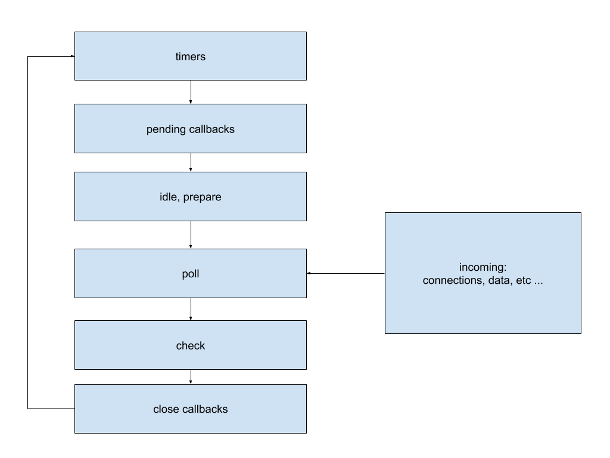

# Interview Questions

A collection of interview questions I've been asked, to help you better prepare for software development interviews - specifically full stack JavaScript Software Engineer interviews.

### Real Interview Questions

1. What interests you about this job in particular?
   - ...
2. How much experience in _____ do you have?
   - My-Awesome-Bootcamp / Training covers in ____months what junior & even some mid level developers cover in ____months / years
3. Have you ever worked as a web developer before? / Have you ever been paid to write software?
   - If they’re looking for someone with “developer” in several previous job titles, that’s not me
   - If they’re most concerned with simply getting the job done, that’s me
4. What are the most important qualities in a developer? / What makes a good developer?
   - base level of knowledge (HTML, CSS, JavaScript, DOM, how the internet works, front end frameworks / view libraries)
   - clear technical communication
   - open-mindedness
   - teamwork
   - persistence
   - how you react to being confused
   - managing the scribe VS conjurer tension
5. What are the 3 most important things to you in a job?
   - The ability to work in in demand, marketable technologies
   - mentorship from lead developers and management
   - quantitative impact on projects with move-the-needle type business outcomes
   - A team & management that set realistic goals
   - competitive compensation package
6. Tell me about yourself? / Who are you as a software engineer / Why do you do this? What do you like about development?
   1. personal narrative ...
7. What do you dislike about development?
   1. Being roadblocked w/deadlines. Teamwork aspect of web development is very important here.
8. What do you think is the largest problem with the UI/UX that if solved, would increase our conversion rate from visitor to paying user?
   1. ...
9. What's something your previous manager did very well? Not so well?
   1.  ...
10. What are the responsibilities of a web developer?
    1.  Building / maintaining web applications / websites
        1.  front end is more concerned with presentation & user interface.
        2.  back end is more concerned with storing, retrieving, & sending data to the front end.
11. How do you take into account SEO, maintainability, UX, performance, & security when you're building a web application?
    1.  SEO is its own field, but web developers can be expected to know some basics (ie, avoid keyword stuffing, use something like [Yoast](https://yoast.com/) if possible)
    2.  Software development is all about tradeoffs - maintainability, UX, performance, & security are all affected by decisions you make regarding those tradeoffs, ie:
        1.  Maintainability - are you incurring technical debt by doing something a "fast" way instead of a cleaner, more best-practice aligned way?
        2.  UX - it might be harder for you to code it a certain way, but perhaps that leads to a better UX
        3.  Performance - there are established patterns of more & less efficient ways to accomplish things - ie, don't load a 2000 x 2000px image if all you're displaying is a thumbnail
        4.  Security - same as above with the patterns, ie, don't submit email & passwords to a server as query strings, they should go in the body of HTTPS POST requests
12. Describe your workflow when you create a web page or web app?
    1.  Ideally, you want to start from a user story, identify key points of the UX, create a mockup of the design, get stakeholder feedback, build out a prototype, get stakeholder feedback again, add tests (or tests first if doing TDD), then add features as needed
13. Tell me about a project that you're particularly proud of. What did you do that worked out well?
    1.  ...
14. What steps do you take to balance demanding client requirements?
    1.  The biggest thing is setting realistic expectations upfront. ie, good-cheap-fast. You get 2 out of the 3. If the client insists on all three, you work with them underpinnings / efficiencies you can discover that enable you to adjust that triangle.
15. How are you keeping up with the latest developments in web development?
    1.  building side projects with new technologies
    2.  medium / dev.to / etc ... articles
    3.  YouTube channels / courses from prominent engineers

#### React
1. Could you describe the React component lifecycle? When in the lifecycle would you bind to events?
   - ...
2. When do you prefer to use the Ref attribute?
   - When you need access to the underlying DOM node (filePicker, media playback, certain animations, working with certain mapping libraries like Leaflet)
3. How do you decide between using a functional VS a class component?
   - Two big reasons to use Class Components are
     - you need state
     - you need to use lifecycle methods, like componentDidMount() or componentDidUpdate()
4. What's the difference between a pure component and a regular component?
   - TODO: complete
5. What sort of patterns do you employ when developing forms in React?
   - Normally controlled components, sometimes uncontrolled (with refs) if I need to customize the validity messages and want to use the DOM api for that.
6. What happens when I enter my username & password into a form & hit login? Describe at as low a level as you can.
   - Assuming we're sending the data as JSON & following best practices. The front end encodes the username & password into a JSON object, then sends them in the body of a POST request to the relevant api endpoint of the server.

#### Security

1. What happens when the username & password reach the server? How does the server verify if the password is correct?
   - The server has to be on & listening at the correct api endpoint & port, and have code set up to handle the type of incoming request - POST, in our case. The server code then reads the body of the POST request, parses the JSON, and continues processing the request with other server code.
   - For your password to be sercurely stored in the company's database (to a reasonable degree) the actual thing - the text - that the company stores in their database is NOT your password, as you remember it.
     - For example, when you enter your email awesomeMegan@gmail.com & password @myFluffyDog42 into the login form and submit them, those bits of text eventually arrive on the web server. There, the server code will ask the database for the stored password it has for awesomeMegan@gmail.com. Assuming you've registered before, the database will send the stored password it has back to the server code. Now the server code can compare the password you typed in - @myFluffyDog42 - with what it received from the database, something like 0E6A48F765D0FFFFF6247FA80D748E615F91DD0C7431E4D9. They're different because what's stored in the database is something called a hashed password. Hashing is a ONE-WAY operation, in that it takes your input string - @myFluffyDog42 - runs it through a function (called a hashing function), and outputs something - in this case the string 0E6A48F765D0FFFFF6247FA80D748E615F91DD0C7431E4D9. This works for passwords / security because hashing functions:
       - Always return the same output for the same input
       - It's not possible to go backwards (ie, take a hash and create the plain text password), even if you know the details of the particular hashing function used.
       - Every input maps to one output (not technically true at the margins, but for all practicality)
     - Some company systems also use a salt, which is a random string (some common ones are combinations of date, IP address, type of web browser, etc...), and combine that with your user supplied password, to create the hashed password. This approach is more secure because then you need something the end user has (password) + something the company has (salt) to generate the correct hashed password.
   - So the server code runs your password - @myFluffyDog42 - (combined with your salt from the database, if they user them) through their hashing function, and compares the hashed password that was just generated with the hashed password retrieved from the database. If they match, the user is then authenticated.
2. How can a user stay logged in, so they don't need to & password?
   - The web app / website can set a cookie on the end user's web browser. Cookies are:
     - small pieces of data
     - in key:value format
     - domain specific
     - sent with every request
   - So, for example, when you sucessfully login to a website / web app, they could generate & save a unique string on your browser as a cookie. Then, later, when that same browser visits the webpage, the cookie gets sent to the web server, (which has code set up to recognize the unique string that it set earlier). This uniquely identifies you to the server, and so it may not ask you to log in again.
3. Can the company retrieve your password for you?
   - Not if they're following security best practices
   - Because hashing is a ONE-WAY transformation, and the company only stores your hashed password, it is NOT possible for the company to send you your password. The best they can do is validate that it is in fact you, then offer to rest your password.
4. What is SQL injection? How do you prevent it?
   - When a web page or web app executes user input directly in an SQL query
   - Don't directly execute uer input. ie, every piece of user input needs to pass input validation before that user input even gets to the part of your system that interacts with the database.
5. Architect a scaled down Facebook app, with a feed display, and a posts display, many users, many posts. FOLLOWUP: How do you make it so anyone can get to it?
   - ...
6. When you have lots of traffic and the website is slow, how do you determine where the bottleneck is, and how would you fix it? FOLLOWUP: If the bottleneck if the server, how would you fix it?
   - ...
7. How do you securely transmit data?
   - ...
8. How do you get your React / Angular / Vue / etc... app onto the server?
   - ...
9. Tell me about a time you missed a deadline, what happened, and how did you fix it?
   - ...
10. Tell me about a time you've worked harder than you should've, and why you did it?
    1. ...
11. What browser do you use to develop and why?
    1. Chrome, dev tools features

#### Page Load Speed

1. What are things you can do to improve page load speed?
   - Run Google's Lightouse, it provides a laundry list of suggestions
   - Reduce size
     - [Images sized appropriately to display sizes](https://web.dev/uses-responsive-images/) (ie, no 2000 x 2000px images if you're displaying a thumbnail)
       - Responsive images (multiple sizes of raster images, serving the appropriate ones with media queries)
       - Using SVGs in some cases
     - [Lazy loading images](https://web.dev/use-lazysizes-to-lazyload-images/)
     - [Videos](https://web.dev/efficient-animated-content/)
       - Prefer MPEG4 over GIFs (especially lager GIFs) when possible
     - [Use modern image formats](https://web.dev/uses-webp-images/) (ie, JPEG 2000 / WebP for better compression algorithms)
     - [Avoid enormous network payloads](https://web.dev/total-byte-weight/)
       - Minify HTML / CSS / JavaScript
     - [Enable text compression](https://web.dev/uses-text-compression/
     - [Lower your time-to-interactive](https://web.dev/offscreen-images)
       - Defer offscreen images
     - Reduce the number of requests
       - Consider server side rendering
     - [Render Blocking](https://web.dev/render-blocking-resources/)
       - Eliminate render blocking resources
     - [Don't chain critical requests](https://web.dev/critical-request-chains/)
     - [Caching](https://web.dev/uses-long-cache-ttl/)
       - Use CDNs
       - Have an efficient cache policy

#### Workflow

1. What's the difference between a text editor & an IDE?
   1. A text editor is for more general purpose text editing (ie, Microsoft Word is a text editor), whereas an Integrated Development Environment has many more features specifically targeted at developers to make their workflows more efficient (ie, syntax highlighting, code completion, integrated terminals, etc...)

#### Fundamentals

1. Explain:
   1. scope
      1. The areas of a running program where a lookup for a given variable can happen
   2. var VS const VS let
      1. three (3) ways of declaring variables in JavaScript
      2. var - uses function scope
      3. const & let
         1. Both use block scope
         2. const variables cannot be reassigned, let variables can
2. What's the difference between
    1. TODO: finish
    2. a variable & a function
    3. an id and a class in CSS?
    4. double (==) & triple (===) equality
        1. double compares with type coercion on, triple with type coercion off
    5. arrow function & 'normal' function
       1. normal function
          1. declared with the `function` keyword
          2. creates a new `this` context
       2. arrow function
          1. declared with arrow function syntax `() => {}`
          2. uses the `this` context of its containing scope
    6. the functions `call` & `apply`. What are they used for?
        1. `call` accepts a list of arguments, whereas `apply` accepts one (1) array with potentially many arguments
        2. `call` & `apply` are used to invoke another function, optionally with:
           1. a different `this` context
           2. additional arguments
    7. `JSON.stringify()` & `toString()`
        1. `toString()`
            1. method on `Object.prototype`
            2. can return different (sometimes surprising!) results for different values (ie, for an obj returns `[object Object]`)
        2. `JSON.stringify()`
            1. method on `JSON`
            2. intended to serialize values into the JSON format for transmission or storage, so the results tend to be more predictable than `toString()`
               1. but doesn't serialize functions or undefined
    8. dot & bracket notation in JavaScript objects?
       1. both syntaxes instruct the interpreter to look for a property on that object with a particular sequence of characters
          1. dot notation looks for literally every character after the dot
          2. bracket notation causes what's inside the bracket to get evaluated, & **that evaluated expression is what's searched for**
3. How does the internet work?
    - TODO: finish

#### CSS

1. What's the difference between
    1. inline and inline-block?
       1. inline-block can assign a height property TODO: link to stackoverflow answer
    2. CSS3 variables & SASS variables?
       1. TODO: finish this
2. What CSS would you use to turn a span into a button?
    - TODO: finish
3. Describe the cascading part of CSS
    - TODO: finish
4. What HTML & CSS would you use to make a horizontal nav bar?
   1. TODO: finish
5. What is a float?
   1. A floated element moves to the left or right of its container, allowing text & inline elements to flow around it
6. What values of the CSS display property can you remember offhand?
   1. [docs](https://developer.mozilla.org/en-US/docs/Web/CSS/display)

#### Project Management

1. Agile VS Waterfall
    - Waterfall
      - Linear, sequential process flow
      - Scope is know, determined right at the beginning
      - Cost / timeline / deliverables flow from scope
      - Changes to scope go through formal change control, almost certainly cause changes to cost / timeline / deliverables ... too many changes can cause it-would-be-better-to-do-a-new-project
      - well suited for tangible, long term things (ie, **when the scope isn't likely to change**)
    - Agile
      - Originally envisioned as a solution to the downsides of waterfall in software development
        - ie, there were better solutions from competitors coming out 0.5 / 1yr into SDLCs ...
      - Change is expected & embraced - don't pre plan too far out into the future
      - Simple project design that becomes more clear throughout the project
      - Uses short iterations (Sprints ~30 days or less) to produce deliverables with feedback (from customer / stakeholder) after each Sprint
      - Incremental process, with customer feedback at each step, instead of all-at-the-end (like in Waterfall)
      - **well suited for knowledge work**
      - Can be challenging for inexperience people to know if they're building the "right-thing-right"
        - ie, when you have to make Waterfall type decisions in an agile process, ex how to handle state, which front end framework, which database, etc ... Each have their own tradeoffs that depend heavily on what the client requirements are (scope) ... if scope changes, what's "best" would change ...

|   |Waterfall|Agile  |
|---|---------|-------|
|Scope (picture of final product)|Clear at the beginning|NOT clear at the beginning|
|Quality VS Speed|Quality|Speed|
|Changes|Formal process for changes|Changes expected|

2. How would you handle someone who approaches you with a project management triangle? (price, speed, cost)
    - TODO: finish
3. You're leading a team that's behind on a deliverable. How do you motivate them to get it done?
    - TODO: finish

#### Functional Programming

1. What is functional programming and what are its benefits?
   1. Style of programming - programming paradigm - where the focus is on each function & its inputs / outputs
      1. Clojure, Haskell, & Lisp are set up in this way. JavaScript is multi-paradigm

|Pros|Cons|
|----|----|
|Easier to reason about & test (because the functions are more self contained|Can be more complicated to write|
|Easier to debug|Can feel like you're jumping through a lot of hoops to maintain the functional paradigm|
|More concise||
|More scalable||
|More predictable (because the functions don't rely on external state)||

1. What are the common parts of functional programming?
   1. first class functions
      1. functions are treated the same as any other variable
   2. higher order functions
      1. functions that accept or return a function, or both (setTimeout, map, filter, reduce, etc...)
   3. Pure functions
      1. a pure function is one that when called with the same input returns the same output

|Pros|Cons|
|---|---|
|Easier to test|Not every task can be accomplished with pure functions|
|Easier to debug||
|More scalable||
|No surprises (ie, mutating the arguments / global state||
|self documenting||
|concurrency||
|cacheable||

  4. function composition
     - the concept of building more complex functions from smaller, more narrowly focused functions
     - piping (ie, sending the output of one function as the input of another function)
  5. currying
     - changing a function so that it returns a new function that solves a more specific version of that problem. Reduces the amount of arguments in the returned function's signature, because at least one of the used-to-be-a-parameter is now an internal variable to that returned function

```js
// not currying
function add(a, b) { return a + b; }

// currying
function makeAdder(x) {
  return function(y) {
    return x + y;
  }
}

add(5, 6); // 11

const add5 = makeAdder(5) // returns a FUNCTION that accepts one argument, and adds 5 to it
add5(6) // 11
```

   6. Immutability
      - Where a data structure is not changeable after creation. String are immutable in JavaScript. Objects & arrays are not.

|Pros|Cons|
|----|----|
|Predictability|Performance hit, because you're copying objects all the time (especially with many tens / hundreds of thousands of objects)|
|Faster change detection for UI frameworks like React. (It's less work to tell if some property has changed, because a whole new object will be created whenever a property changes, and so the framework can do a computationally cheap referential identity check to see it it needs to update the UI (instead of a computationally expensive recursive check)|Memory overhead (because of all the object copies|
|Concurrency - more scalable code, because you can run multiple functions in parallel (because they're not relying on external state to be a certain way, they're always creating NEW state||

There are libraries such as Immutable.js & Immer to make handling this easier in JavaScript

#### Node.js

1. What is Node.js?
   1. an open source, cross platform runtime environment for executing JavaScript (ie, so that JavaScript can get exectued outside of web browsers)
      1. In 2009, Ryan Dahl, creator of Node.js
         1. Took Google's V8 engine, embedded it in a C++ program, which he called Node.js
         2. This program includes the JavaScript V8 engine, as well as some additional modules that provide backend specific functionality (ie, browsers do NOT have these modules, because they're designed to run client side JavaScript - for example, Node doesn't have a DOM)
2. What is Node.js used for?
   1. Building web servers, back-end services (APIs), that power client apps (web apps and mobile apps)
3. What is Node.js good for?
   1. highly scalable
   2. data intensive
   3. real-time apps
4. What separates Node.js from other back end architectures / frameworks? (like django, rails, ASP.NET, etc...)
   1. relatively easy to get started, so prototyping can happen relatively faster (fits better with Agile development)
   2. Can build highly scalable services that are quite fast
      1. Used in production by giants like Walmart, [Paypal](https://medium.com/paypal-engineering/node-js-at-paypal-4e2d1d08ce4f), [Netflix](https://www.youtube.com/watch?v=gtjzjiTI96c&list=PLfXiENmg6yyUpIVY9XVOkbdmBPx6PUm9_), etc...
   3. JavaScript everywhere (so the same language for front & back ends)
      1. leads to cleaner & more consistent source code (ie, same naming conventions, tools, & best practices)
   4. Large ecosystem of open source libraries available, through npm
5. Explain several differences between Node.js & client side JavaScript
   1. There are no `window` / `document` global objects in Node.js, because **Node.js is a different C++ program than browsers** are, so they provide **different environment objects**
      1. Node.js provides modules like fs, path, http, event, os, etc...
   2. Both Node.js & the browser (Chromium, specifically) share the same JavaScript engine (V8), but they provide **different runtime environments for JavaScript**
6. Explain the Node.js architecture
   1. Uses the same JavaScript engine that Chrome (& now Edge) use, V8
   2. Node.js is NOT a ______ (so comparisons to _____ are misguided)
      1. programming language (like Ruby / C# / etc...)
      2. framework (ASP.NET, Rails, Django / etc...)
   3. Non-blocking (asynchronous)
      1. A single thread is used to handle multiple requests
      2. This is in contrast to blocking (synchronous) architecture (defaults for Rails / ASP.NET)
         1. When a request is received on the server, a thread is allocated to handle that request
         2. It's likely that there's some asynchronous task (database query, file I/O, etc...) that needs to happen to complete the request
         3. While the async task is happening, the thread is sitting there, waiting
            1. it CANNOT be used to serve another client (another request)
         4. **So to handle another request, we need another thread**
            1. When we have many concurrent clients (requests), **each request gets a separate thread**
            2. At some point, we're going to run out of threads to serve clients (all threads busy!)
            3. New clients have to wait until free thread are available OR we need to add more hardware (ie, increase the number of available threads in the whole system - $$$)
               1. Not using threads efficiently (they're waiting, not doing anything) during the async portion of the requests
         5. Node.js apps are asynchronous by default
            1. Single thread that handles all requests
            2. When the asynchronous portion of the request finishes, it puts a message in the event queue
               1. Node.js continuously monitors this queue in the background. When there's an event here, it takes it out & processes it.
            3. This kind of architecture is** ideal for I/O intensive apps** (ie, lots of disk and / or network access)
               1. Can serve more clients without the need to add more hardware (because the thread isn't waiting during the asynchronous portion of the requests, the one single thread gets released to serve other clients)
            4. Because of this architecture, Node.js is terrible for CPU intensive apps
               1. Because there's only the one (1) single thread to do JavaScript work on, so if you keep that thread busy with CPU heavy tasks (video encoding / image manipulation), everything else has to wait
         6. Blocking in Node.js
            1. Blocking in Node.js is when the Node.js process needs to wait for the completion on non-JavaScript operations (like network of file I/O) before processing additional JavaScript
               1. Ex, "Sync" versions of common module methods, ie, `readFileSync()`
7. Explain the Node.js event loop
   1. Allows Node.js to do non blocking I/O, even though JavaScript is single threaded, because the event loop offloads operations to the system kernel whenever possible.
      1. Most modern kernels are multithreaded, & can handle several operations executing in the background. When one of those operations completes, the kernel tells Node.js so that the appropriate callback can be added to the queue in the poll phase of the event loop
   2. [libuv](https://libuv.org/) is a C library that provides the event loop to JavaScript
8. What are some common Event Loop misconceptions? [source](https://medium.com/the-node-js-collection/what-you-should-know-to-really-understand-the-node-js-event-loop-and-its-metrics-c4907b19da4c)
   1. ~~the event loop runs in a separate thread than the user code~~
      1. **Node.js has only one thread that executes JavaScript code** & this is the thread where the event loop is running
   2. ~~Everything that's asynchronous is handled by a thread pool~~
      1. libuv prefers to use operating system / 3rd party subsystem (ie, database) asynchronous interfaces
      2. If there is no other option, libuv will handle asynchronous operations with the default thread pool of four (4) threads that it creates
   3. ~~The event loop is something like a stack of queue~~
      1. The event loop is a set of phases with specific tasks that are processed in round robin format

##### The Node.js Event Loop

1. General sequence
   1. Node.js starts
      1. initializes event loop
      2. processes provided input script / drops into REPL
         1. the script likely has synchronous code, & potentially:
            1. async API calls - like `readFile()`
            2. timers - like `setTimeout()` or `setImmediate()`
            3. process.nextTick()
      3. Begins processing event loop
   2. Event loop phases (order of operations)
      1. technically 7 or 8, but 6 are relevant for most developers




  1. Each of these phases has a FIFO queue of callbacks to execute. In general, the event loop will run the code specific to that phase, then synchronously process the callbacks in the queue, until:
     1. All callbacks in that phases' queue have been processed
     2. The system-dependent maximum number of callbacks has been reached (callback limit)
  2. Then, the event loop will move to the next phase, and so on
  3. Any of these operations can schedule more operations
     1. because the kernel queues new events into the poll phase, this phase in particular can run for a little while (relatively speaking) if there are long running callbacks

1. Phases (overview)
   1. timers - executes callbacks schedule by `setTimeout()` / `setInterval()`
   2. pending callbacks - executes I/O callbacks deferred to the next loop iteration
   3. idle, prepate - used internally by Node.js
   4. poll
      1. retrieve new I/O events
      2. execute I/O related callbacks
         1. except `setTimeout()`, `setInterval()`, `setImmediate()`, close callbacks
      3. Node.js will block here when appropriate
   5. check - execute callbacks schedule by `setImmediate()`
   6. close callbacks - execute callbacks like `socket.on('close', ...)`

2. Phases (details)
   1. timers
      1. specifies a minimum delay after which a callback may be executed
   2. pending callbacks
      1. some callbacks from certain system operations (ie, TCP connection receives ECONNREFUSED)
   3. idle, prepare - only used internally by Node.js
   4. poll
      1. calculating how long it should block and poll for I/O, then
      2. processing event in the poll queue
      3. event loop enters poll phase & no timers are scheduled
         1. if poll queue is empty
            1. if `setImmediate()` timers are scheduled
               1. end poll phase, go to check phase, execute `setImmediate()` callbacks
            2. else
               1. wait here for callbacks to be added to the queue, then execute them immediately
         2. else
            1. iterate over poll queue & synchronously execute callbacks there until
               1. queue is empty
               2. system-dependent callback limit has been reached
      4. When the poll queue is empty, the event loop will check for timers whose thresholds have been reached
         1. If there are any, go back to the timers phase to execute those callbacks
   5. check
      1. > "Generally, as code is executed, the event loop will hit the poll phase and will wait for incoming connections, requests, etc... However, if a callback has been scheduled with `setImmediate()` and the poll phase becomes idle, it will end & continue to the check phase, rather than waiting for poll events." [source](https://nodejs.org/uk/docs/guides/event-loop-timers-and-nexttick/#check)
      2. `setImmediate()` is a special timer that runs in a separate phase of the event loop. Callbacks scheduled with `setImmediate()` will run immediately* after the poll phase completes (the poll queue is empty)
   6. close callbacks
      1. > "If a socket or handle is closed abruptly (ie, `socket.destroy()`), the 'close' event will be emitted in this phase. Otherwise it will be emitted by `process.nextTick()`." [source](https://nodejs.org/uk/docs/guides/event-loop-timers-and-nexttick/#close-callbacks)
3. `setImmediate()` VS `setTimeout()`
   1. If scheduled within an I/O cycle:
      1. `setImmediate()` will always run immediately* after the current poll phase completes (after the poll queue is empty)
      2. `setTimeout()` will run when the poll queue is empty, after the timer's threshold has been reached
      3. Run this way, `setImmediate()` will always be executed before `setTimeout()`
   2. If not scheduled within an I/O cycle (ie, in the main module)
      1. Order is non-deterministic, because:
      > "The timing will be bound by the performance of the process (which can be impacted by other applications running on the machine)" [source](https://nodejs.org/uk/docs/guides/event-loop-timers-and-nexttick/#setimmediate-vs-settimeout)
4. `process.nextTick()`
   1. Technically not part of the event loop
   > "The nextTickQueue will be processed after the current operation is completed, regardless of the current phase of the event loop". Operations here means the "transition from the underlying C/C++ handler, and handling the JavaScript that needs to be executed" [source](https://nodejs.org/uk/docs/guides/event-loop-timers-and-nexttick/#process-nexttick)

   > "All callbacks passed to process.nextTick() will be resolved BEFORE the event loop continues." [source](https://nodejs.org/uk/docs/guides/event-loop-timers-and-nexttick/#process-nexttick)
   1. Done this way because of a design philosophy where things should be async even when they don't strictly need to be.
5. `process.nextTick()` VS `setImmediate()`
   1. `process.nextTick()`
      1. fires on the same phase, when the current operation completes
   2. `setImmediate()`
      1. fires on the following iteration / 'tick' of the event loop (ie, when the poll queue is empty)
6. Why would you use `process.nextTick()`?
   1. when some logic needs to happen immediately after 1 particular async task, BEFORE the event loop continues
      1. handle errors
      2. clean up unneeded resources
      3. try a request again
   2. > Run a callback "after the call stack has unwound but before the event loop continues" [source](https://nodejs.org/uk/docs/guides/event-loop-timers-and-nexttick/#why-use-process-nexttick)


### Browsers

1. What's the difference between:
   1.  AJAX & page requests?
       1. AJAX (XMLHttp) requests
          1. made by JavaScript, & only JavaScript
          2. sent to the server AFTER the page has loaded
          3. is a request for **data**
       2. page requests
          1. initiated by the browser (in whatever code the browser is written in, probably C++)
          2. THIS is the request for the initial page (or a new / updated / different page)
          3. is a request for a document (in some format, like HTML)
   2. web & internet?
      1. web
         1. series of documents using a markup language (like HTML)
         2. with hyperlinks linking them together
         3. and a browser to read those documents (screen readers are also browsers)
      2. internet
         1. many other protocols / networks, including:
            1. email servers
            2. FTP
            3. 90s style internet chat rooms (AOL / Yahoo Mail / etc...)
            4. SSH
   3. local storage & cookies
      1. TODO: finish this
   4. TCP & UDP
      1. TCP specifies that the client tell the server info about the message (ie, what / how many packets, etc...) it's sending, so the server can be assured it received all the packets of a message.
         1. **TCP is slower than UDP**
      2. UDP simply sends packets, without metadata about those packets. Use case is really games, where performance (especially of the system as a whole) is much more critical than dropping ceratin packets.
2. Does a 2xx status code always mean the request was completely succeessful?
   1. 200-something status codes do indeed mean success, but not necessarily complete & utter success.
      1. 206 status means partial success (for example, perhaps 14 of your 15 database queries were successful)
3. Do subdomains have unique IP addresses?
   1. yes
4. How many unique requests can be outstanding to a given IP address?
   1. 20
      1. for example, a page can simultaneously have 20 open requests each to:
         1. blog.fb.com
         2. fb.com
         3. www.fb.com
         4. etc...
5. Is there a general ordering for script & link tags in the head of an HTML document? Why? Any exceptions?
   1. TODO: finish


### Accessibility (A11y)

1. What are aria labels & why are they used?
2. Is there a "source-of-truth" for accessibillity in web development? If so, what is it?
   1. [Perhaps, there's a guiding document called with WCAG 2.0 AA](https://www.w3.org/TR/WCAG20/)
      1. [In courts in the US, ADA compliance for websites has generally meant that you meet the 38 succeess criteria outlined in WCAG 2.0 AA](https://medium.com/@krisrivenburgh/the-ada-checklist-website-compliance-guidelines-for-2019-in-plain-english-123c1d58fad9)
3. Why should web developers code for accessibility?
   1. better SEO
   2. displays good morals as a company, so better public image
   3. many accessibility practices will also make your site faster, soyou should be doing them anyway
   4. in many countries, it's the law (ADA in the US)
4. Who are the traditional target populations for accessibility?
   1. visual
   2. auditory
   3. motor
   4. cognitive
5. Does coding for accessibility take longer than coding while ignoring it?
   1. not necessarily
      1. if you're refactoring already written code for accessibility, then yes, it might add developer hours. If you're merging accessibility into the workflow, then any added developer time is likely negligible
      2. It's arguably easier to develop with, because it forces best practices, and so the code that's produced will be more performant
6. List some accessibility best practices related to HTML
   1. What is POSH?
      1. "Plain Old Semantic HTML", ie, using tags for what they're meant for
         1. NOT everything-is-a-div web apps, `<main>` / `<header>` / `<footer>` / `<section>` / `<article>` / `<aside>` / etc...
   2. `<button>` for interactivity, if at all possible
      1. because `<button>`s can be tabbed into for focus, and engaged with enter/return, by default
   3. Always use meaningful `<label>`s with `<input>`s
   4. `` tags with alt & title attributes, OR aria-
   5. useful text descriptions in links
      1. ie, `<a href="..."><p>Learn more about corgis here</p></a>`
      2. NOT `<p>Learn more about corgis <a href="...">here</a></p>`
   6. use skip links
   7. Links to non-HTML resources
   8. Links that open a new tab or window should be marked as such
   9. be careful about messing with default link styling, consider contrast guidelines
   10. `<th>`s & `<caption>`s with `<table>`s
7. List some accessibility best practices related to CSS
    1. sufficient proximity between clickable elements (ie, touch targets should be at least 48 x 48px)
    2. match user expectations & conventions
        1. ie, don't make _____ not look like a _____ (with headers, emphasized text, abbreviations, links)
    3. Tables - headers, zebra striping help
    4. color contrast is compliant with WACG 2.0 AA
        1. tools like [https://webaim.org/resources/contrastchecker/](https://webaim.org/resources/contrastchecker/)
    5. Hiding things
        1. Exercise caution using:
           1. `visibility: hidden`
           2. `display: none`
    1. Accept that users can override styles
        1. ie, zooming the text to 200% shouldn't break the layout (use scrollbars)
8. List some accessibility best practices related to JavaScript
   1. Keep JavaScript unobtrusive
      1. ie, there should some version of the site accessible to a screen-reader, only using a keyboard
   2. Mouse-specific events (mousover, mouseout, etc...)
      1. include additional triggers for the event handlers - onfocus / onblur
9. Explain WAI-ARIA
   1. Adds additional semantics for screen readers through HTML attributes. There are four (4) main areas where this is useful.
       1. signposts / landmarks via roll
           1. ie, to replace / extend HTML semantics
       2. dynamic content updates via aria-live
           1. ie, AJAX requests
       3. enhancing keyboard accessibility
           1. using tabindex
       4. accessibility of non-semantic controls
           1. ie, complex UI features
   2. Some might say it's possible to go overboard with WAI-ARIA ... aim for balance
